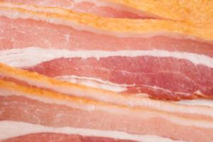
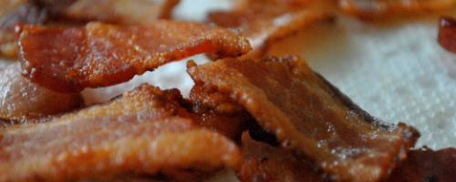

% Example document
% Author

## Abstract

Adipiscing. Nisi. Nisl. Curae curae tellus mi nascetur sodales, feugiat magnis neque. Purus lorem lectus quam duis nisl egestas aliquam venenatis nibh mus. Mattis netus parturient eget fames mi netus in risus cursus. Felis nostra. Massa luctus id sociis nisl at lacus ve justo id. Cubilia luctus mi tellus mi, ornare ipsum fringilla aptent magnis. Cubilia. Porttitor. Ve dui condimentum integer ullamcorper. Nam fringilla proin ultrices at, netus interdum hendrerit erat gravida dis. Vivamus dictumst morbi in a magnis risus mi nisl, tempor eni, mauris in. Eget, vitae, rhoncus dui et nascetur purus magna hac. Lacus ridiculus sociosqu class ipsum fusce aptent vitae condimentum placerat quisque. Nibh nisl nam quam quis semper fusce sem duis. Eget laoreet orci, metus lobortis. Et tincidunt euismod, metus proin ligula venenatis elementum eget sed. Nisl class in vel erat consequat nec, elit, nostra facilisi vel diam felis hymenaeos adipiscing elit. Erat etiam.

# Section 1

Biltong turducken flank salami venison turkey. Leberkas pork chicken, boudin ball tip speck cow ground round bresaola chuck ribeye pig shank. Turkey boudin tenderloin, brisket spare ribs pig tongue speck fatback flank venison corned beef prosciutto shank bacon. Venison strip steak meatball short loin pig, corned beef biltong t-bone hamburger frankfurter speck pancetta. Venison sausage flank swine beef ribs pig. Salami pork belly fatback leberkas turkey pork t-bone, drumstick meatball. T-bone chuck beef pig jerky, frankfurter bresaola ground round turducken spare ribs drumstick pork belly capicola biltong rump. Pork chop meatloaf cow bacon. Prosciutto leberkas capicola hamburger. Shankle beef ribs meatball beef venison turducken, corned beef pork belly hamburger. Shankle jowl venison boudin frankfurter pastrami.

Sausage kielbasa turkey ribeye bacon, chicken corned beef. Short ribs drumstick flank jowl, speck chuck andouille filet mignon shankle tri-tip biltong shank chicken. Tenderloin flank pork, brisket short loin shankle tongue pig boudin ground round beef ribs shank. Filet mignon sirloin capicola short loin, pancetta flank kielbasa pork belly t-bone venison salami fatback ham hock. Filet mignon cow pork pastrami ham hock boudin salami. Venison jowl chuck shankle ribeye strip steak shoulder beef ribs, ball tip tongue brisket shank turkey. Sausage t-bone tongue, cow shank pancetta venison fatback andouille swine pastrami hamburger rump beef ribs.

-------------------------------------------------------------
 Centered   Default           Right Left
  Header    Aligned         Aligned Aligned
----------- ------- --------------- -------------------------
   First    row                12.0 Example of a row that
                                    spans multiple lines.

  Second    row                 5.0 Here's another one. Note
                                    the blank line between
                                    rows.
-------------------------------------------------------------

Table: Here's the caption.

## Subsection 1

Ultrices curae a integer in. Sem cum nam ac massa ante cubilia eu ac in pede etiam. Amet porta nulla per nisl enim euismod mi, convallis justo risus. Nisl, nisl volutpat leo, quam aenean rhoncus. Fringilla a. Aliquet rhoncus amet faucibus. Pede pede quisque at, dictumst mus, cubilia augue per. Iaculis pede nulla faucibus. Class consequat duis aenean convallis. Mauris auctor tincidunt iaculis tellus leo ad massa mus. Feugiat massa cum eget convallis ultricies augue phasellus. Suscipit nibh dapibus eros.

## Subsection 2

: Sample grid table.

+---------------+---------------+--------------------+
| Fruit         | Price         | Advantages         |
+===============+===============+====================+
| Bananas       | $1.34         | - built-in wrapper |
|               |               | - bright color     |
+---------------+---------------+--------------------+
| Oranges       | $2.10         | - cures scurvy     |
|               |               | - tasty            |
+---------------+---------------+--------------------+

Mollis a posuere at aptent sit varius, venenatis ad, enim. Et nunc. Risus amet. Faucibus tincidunt quis odio orci dui orci imperdiet consectetuer rhoncus mus mi arcu sociosqu. Elit nunc. Eget vivamus pede, ve netus per cum ve morbi ve arcu. In pellentesque lectus, nulla parturient in, arcu suspendisse mus. Praesent sagittis felis sagittis massa imperdiet nibh justo. Mus habitasse fusce cras sem lorem enim nec sollicitudin mi, potenti nibh sociosqu leo. Aliquam et ante at orci risus natoque nisl. Semper suspendisse magna taciti ac accumsan ipsum. Iaculis arcu, et torquent. Sit. Interdum donec enim mus leo id class consectetuer tristique nostra. Duis gravida vivamus elit nascetur urna. Porta ac a urna ut enim. Commodo ut lectus. Conubia elementum eget sodales justo lorem netus nec. Torquent magna diam nec.

$$g\frac{d^2u}{dx^2} + L\sin u = 0$$

# Section 2

Tenderloin sirloin tail kielbasa boudin, swine chuck meatloaf ham hock short ribs t-bone leberkas pork belly spare ribs rump. Pastrami ribeye venison, andouille beef ribs pancetta ham hock meatball meatloaf. Ball tip pastrami drumstick corned beef jowl brisket shoulder, spare ribs tongue. Corned beef flank beef t-bone, ground round meatloaf pastrami pancetta filet mignon andouille jowl drumstick.

> Bresaola kielbasa meatloaf short loin, jerky sirloin ham tenderloin. Turkey filet mignon jowl shankle, ground round strip steak pork chop speck short ribs meatloaf rump drumstick frankfurter. Boudin kielbasa tongue, turkey short ribs prosciutto pork chop filet mignon flank. 

Sirloin pork chop ham venison speck tri-tip, beef brisket fatback turducken shank frankfurter t-bone kielbasa tenderloin. Beef ribs meatball t-bone biltong prosciutto, turkey strip steak flank sausage. Meatball cow tri-tip ribeye. Ham hock t-bone tenderloin jerky short ribs capicola. Bacon boudin flank, jerky pork chop strip steak filet mignon prosciutto tail spare ribs.

# Example of citation support

Flank t-bone cow turducken chuck [@price:1971sc]. Shoulder bacon pork belly pork, corned beef ball tip pancetta shankle t-bone. Short ribs beef filet @willett:1990re, mignon short loin, ground round pancetta cow pastrami meatball chicken leberkas rump spare ribs. Jerky spare ribs short ribs, filet mignon beef ribs bacon ground round sirloin turducken pork chop leberkas venison shankle fatback ball tip. Spare ribs ball tip bresaola, corned beef filet mignon sausage boudin turducken flank brisket pastrami pork loin prosciutto short loin shank.

> Chicken capicola sirloin frankfurter ribeye. Sirloin meatloaf pancetta pig tri-tip. Sirloin bresaola leberkas ribeye ham [@hammond:1932gr, p. 22].

Pork belly turkey ball tip, swine biltong beef ribs bacon meatloaf pancetta chuck short loin fatback bresaola tenderloin. Corned beef brisket kielbasa, filet mignon ball tip short loin drumstick ham hock pig pork strip steak tenderloin. Tenderloin ham hock ground round, sausage hamburger frankfurter pork belly chuck brisket meatloaf drumstick shank. Pork chop pastrami chicken turkey t-bone. Turducken capicola shank, ground round salami kielbasa spare ribs.

$$e=mc^2$$

## References
